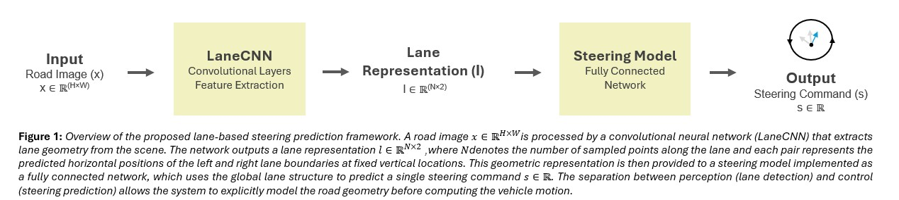

# Lane-Based Steering Prediction Framework


This repository contains a small example implementation from my Medium article on **lane-based steering prediction for autonomous driving**.

Instead of training a single end-to-end neural network to directly output steering commands from images, this project demonstrates a **modular approach** where perception and control are separated into two components.

The system is composed of:

- **Lane Detection Model (CNN)** – extracts lane geometry from the road image  
- **Steering Model** – predicts the steering command based on the detected lane coordinates  

By separating these two tasks, the perception model focuses on understanding the visual scene, while the second model focuses on computing the appropriate vehicle motion. The goal of this example is to demonstrate how a **structured Framework** can be used instead of a fully end-to-end approach.

Benefits of this design include:

- Improved interpretability of the system  
- Easier debugging  
- Clear separation between perception and control  
- Ability to improve or replace individual components independently  

For example, the lane detection network could later be replaced with a more advanced perception model without modifying the steering model.


---

  
# Framework Overview

The overall Framework follows this structure:

<p align="center">
  
</p>


---

# Synthetic Dataset

For demonstration purposes, the project generates **synthetic road images containing lane markings**.

These synthetic samples simulate simple lane geometries and provide:

- input road images  
- lane coordinates  
- corresponding steering commands  

This makes the project lightweight and easy to reproduce without requiring a large driving dataset.

The data generator can easily be replaced with **simulation data or real driving datasets**.

---

# Dependencies

Install the required libraries before running the project:

```bash
pip install torch matplotlib numpy
